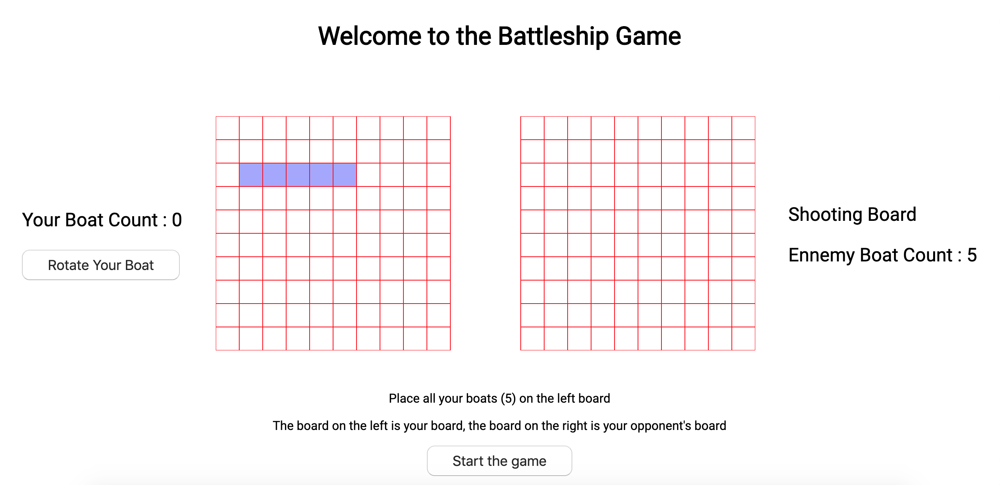

<h1>Battleship Game</h1>

Battleship is a multiplayer game were each players has to destroy the boats of the ennemy in order to win the game

<h2>Build With<h2>
<ul>
    <li>HTML</li>
    <li>SCSS</li>
    <li>Javascript</li>
    <li>p5</li>
    <li>nodejs</li>
    <li>socket.io</li>
</ul>

<h2> Preview<h2>

<h2> Features </h2>
<ul>
    <li>Preview before you place your boat</li>
    <li>Rotation for each boat</li>
    <li>A count for each player's boat</li>
    <li>Multiplayer (1vs1)</li>
</ul>

<h2> Goal </h2>

The goal was to improve my skill with nodejs and socket.io

<h2> More info </h2>

I din't spend time to make it beautiful because  it wasn't the point of the excercise.

<h2> Author </h2>

Matis Karamenderes
 

12 december 2019

